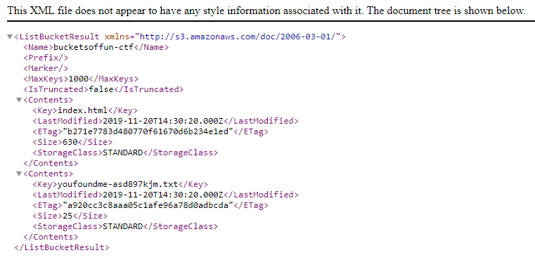

# Buckets of Fun

The challenge description only contains the link `http://bucketsoffun-ctf.s3-website-us-east-1.amazonaws.com/`

Visiting the link gives a plain webpage with a password field.

Looking at the source, it's a static site with no actual authentication. Hitting 'Enter' only opens a JavaScript alert saying "You won't be getting around this auth.".

Given the link, it's obvious this is an S3 bucket which is notorious misconfigurations. In this case, the policy is setup to allow ListObject and GetObject from any source. There are at least two ways to find the flag, using a browser or the AWS CLI.

## Browser

1. Every S3 bucket is given a subdomain `<bucket-name>.s3.amazonaws.com/`. Visiting `https://bucketsoffun-ctf.s3.amazonaws.com/` lists the contents of the bucket.

    

2. Visiting `https://bucketsoffun-ctf.s3.amazonaws.com/youfoundme-asd897kjm.txt` or `https://bucketsoffun-ctf.s3.amazonaws.com/youfoundme-asd897kjm.txt` will give the flag.

    

## AWS CLI

The AWS CLI can be installed using [this guide](https://docs.aws.amazon.com/cli/latest/userguide/cli-chap-install.html).

To solve the challenge: 

1. List the contents of the bucket using `ls`

    `aws s3 ls bucketsoffun-ctf`

    

2. Download the file using `cp`

    `aws s3 cp s3://bucketsoffun-ctf/youfoundme-asd897kjm.txt .`

    Reading the file gets the flag.

    `cat youfoundme-asd897kjm.txt`

    